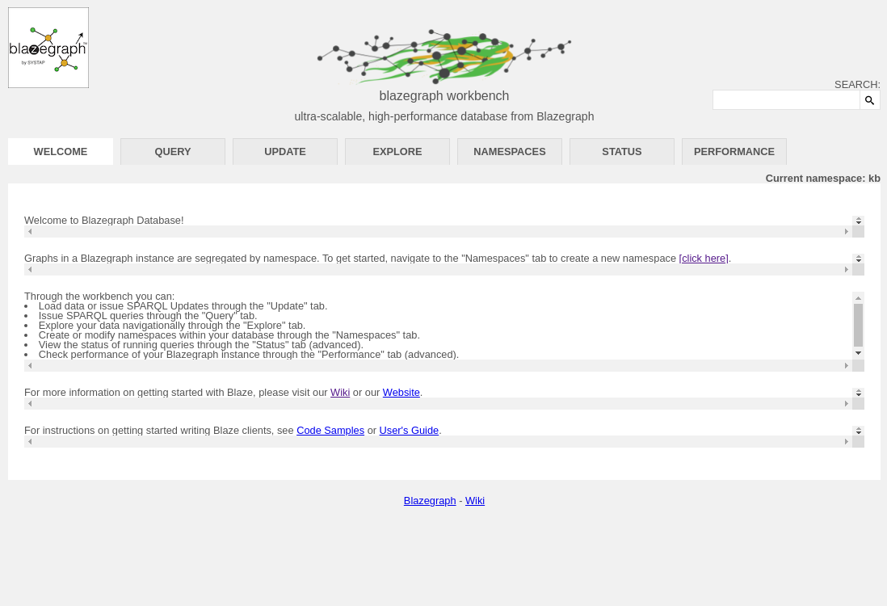
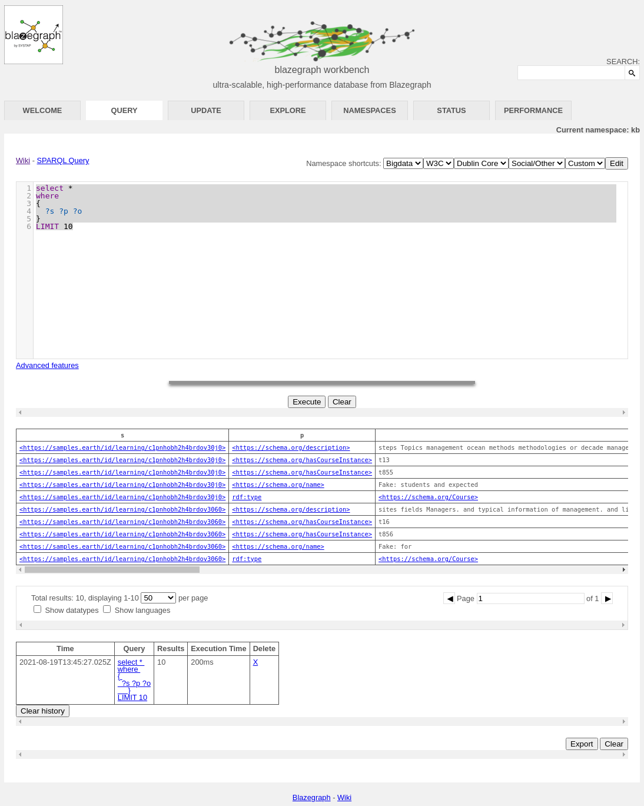

# Gleaner CLI Docker Image

## QuickStart

Before using Gleaner, not that Gleaner does have one prerequisit in the form of an accessible S3 compliant 
object store.  This can be AWS S3, Google Cloud Storage or others.  Also, there is the open source 
and free Minio object store which is used in many of the examples in GleanerIO. 

Once you have the object store running and ready you are ready to run Gleaner. 
Pull down the release that matches your ssysem from [version 3.0.4](https://github.com/gleanerio/gleaner/releases/tag/v3.0.4-dev).
Below is an example of pulling this down for a Linux system on ADM64 architecture.  

```
wget https://github.com/gleanerio/gleaner/releases/download/v3.0.4-dev/gleaner-v3.0.4-dev-linux-amd64.tar.gz
```

You will need a configuration file and an example such file can be found in the resources directory.

You can set the values in this configuration file.  However, you can leave the Minio value empty and pass
then via environment variables.  This sort of approach can work better in some orchestration environments or just 
be a safer approach to managing these keys.  

```
export MINIO_ADDRESS=
export MINIO_PORT=
export MINIO_USE_SSL=
export MINIO_ACCESS_KEY=
export MINIO_SECRET_KEY=
export MINIO_BUCKET=
```

With those set and your configuration file in palce you can run Gleaner with 


```
  ./gleaner -cfg gleanerconfig.yaml --source iris -rude
```


## About

This is a new approach for quick starts with Gleaner.  It is a script that exposes
a containerized version of Gleaner as a CLI interface.

You can use the -init flag to pull down all the support files you need including
the Docker Compose file for setting up the object store, a triplestore and 
the support for headless indexing.  

## Prerequisites

You need Docker installed.  Later, to work with the results and load them into a
triplestore, you will also need an S3 compatible client.  We will use the Minio
client, mc, for this.  

## Steps

Download the script gleanerDocker.sh from https://github.com/gleanerio/gleaner/tree/master/docs/cliDocker You may need to make it run-able with 

```bash
curl -O https://raw.githubusercontent.com/earthcubearchitecture-project418/gleaner/master/docs/cliDocker/gleanerDocker.sh

chmod 755 gleanerDocker.sh
```

Next you can run the script with the -init flag to pull down all the support files you need.

```bash
./gleanerDocker.sh -init
```

This will also download the needed docker image and the support files. 
Your directory should look like this now:

```bash
fils@ubuntu:~/clidocker# ls -lt
total 1356
-rw-r--r-- 1 fils fils    1281 Aug 15 14:07 gleaner-IS.yml
-rw-r--r-- 1 fils fils     290 Aug 15 14:07 setenvIS.sh
-rw-r--r-- 1 fils fils    1266 Aug 15 14:07 demo.yaml
-rw-r--r-- 1 fils fils 1371350 Aug 15 14:07 schemaorg-current-https.jsonld
-rwxr-xr-x 1 fils fils    1852 Aug 15 14:06 gleanerDocker.sh
```

Let's see if we can setup our support infrastructure for Gleaner.  The 
file gleaner-IS.yml is a docker compose file that will set up the object store,
and a triplestore.

To do this we need to set up a few environment variables.  To do this we can 
leverage the setenvIS.sh script.  This script will set up the environment we need.
Note you can also use a .env file or other approaches.  You can references 
the [Environment variables in Compose](https://docs.docker.com/compose/environment-variables/) documentation.  

```bash
root@ubuntu:~/clidocker# source setenvIS.sh 
root@ubuntu:~/clidocker# docker-compose -f gleaner-IS.yml up -d
Creating network "clidocker_traefik_default" with the default driver
Creating clidocker_triplestore_1 ... done
Creating clidocker_s3system_1    ... done
Creating clidocker_headless_1    ... done
```

Note:  In a fresh run all the images will be pulled down.  This may take a while.

In the end, you should be able to see these images running:

```bash
root@ubuntu:~/clidocker# docker ps
CONTAINER ID        IMAGE                            COMMAND                  CREATED              STATUS              PORTS                                              NAMES
a26f7c945479        nawer/blazegraph                 "docker-entrypoint.s…"   About a minute ago   Up About a minute   0.0.0.0:9999->9999/tcp                             clidocker_triplestore_1
f3a4197c42be        minio/minio:latest               "/usr/bin/docker-ent…"   About a minute ago   Up About a minute   0.0.0.0:9000->9000/tcp, 0.0.0.0:54321->54321/tcp   clidocker_s3system_1
062f029462b1        chromedp/headless-shell:latest   "/headless-shell/hea…"   About a minute ago   Up About a minute   0.0.0.0:9222->9222/tcp  
```

At this point we should be able to do a run.  During the init process a 
working config file was downloaded.   

> Note:  This config file will change...  it's pointing to an OIH partner 
> and I will not do that for the release.  I have a demo site I will use.  

Next we need to setup our object for Gleaner.  Gleaner itself can do this 
task so we will use 

```bash
root@ubuntu:~/clidocker# ./gleanerDocker.sh -setup -cfg demo
main.go:35: EarthCube Gleaner
main.go:110: Setting up buckets
check.go:58: Gleaner Bucket gleaner not found, generating
main.go:117: Buckets generated.  Object store should be ready for runs
```

> Note:  Here is where we go off the rails.  The config file uses 0.0.0.0 as the 
> location and this is not working.   You need to edit the config file with the 
> "real" IP of the host machine.  In may case is this 192.168.122.77.  This is 
> obviously still a local network IP but it does work.  I am still investigating 
> this issue.

We can now do a run with the example template file.  

> Note:  Best to delete the "sitegraph" node, I will do that soon.  It should 
> work, but is currently slow and gives little feedback

If everything goes well, you should see something like the following:

```bash
root@ubuntu:~/clidocker# ./gleanerDocker.sh -cfg demo
main.go:35: EarthCube Gleaner
main.go:122: Validating access to object store
check.go:39: Validated access to object store: gleaner.
org.go:156: Building organization graph (nq)
org.go:163: {samplesearth  https://samples.earth/sitemap.xml false https://www.re3data.org/repository/samplesearth Samples Earth (DEMO Site) https://samples.earth}
main.go:154: Sitegraph(s) processed
summoner.go:16: Summoner start time: 2021-08-15 14:34:08.907152656 +0000 UTC m=+0.067250623 
resources.go:74: samplesearth : 202
 100% |██████████████████████████████████████████████████████████████████████████████████████████████████████████████████████████████████████████████████████████████████████████████████| (202/202, 20 it/s)        
summoner.go:34: Summoner end time: 2021-08-15 14:34:20.36804137 +0000 UTC m=+11.528139340 
summoner.go:35: Summoner run time: 0.191015 
webfeed.go:37: 1758
millers.go:26: Miller start time: 2021-08-15 14:34:20.368063453 +0000 UTC m=+11.528161421 
millers.go:40: Adding bucket to milling list: summoned/samplesearth
millers.go:51: Adding bucket to prov building list: prov/samplesearth
 100% |█████████████████████████████████████████████████████████████████████████████████████████████████████████████████████████████████████████████████████████████████████████████████| (202/202, 236 it/s)        
graphng.go:77: Assembling result graph for prefix: summoned/samplesearth to: milled/samplesearth
graphng.go:78: Result graph will be at: results/runX/samplesearth_graph.nq
pipecopy.go:16: Start pipe reader / writer sequence
graphng.go:84: Pipe copy for graph done
millers.go:80: Miller end time: 2021-08-15 14:34:21.84702814 +0000 UTC m=+13.007126109 
millers.go:81: Miller run time: 0.024649 

```

## Working with results

If all has gone well, at this point you have downloaded the JSON-LD documents into Minio or 
some other object store.Next we will install a client that we can use to work with these objects.

Note, there is a web interface exposed on the port mapped in the Docker compose file.
In the case of these demo that is 9000.  You can access it at
http://localhost:9000/ with the credentials set in the environment variable file.  

However, to work with these objects it would be better to use a command line tool, like mc.
The Minio Client, can be installed
following their [Minio Client Quickstate Guide](https://docs.min.io/docs/minio-client-quickstart-guide.html).
Be sure to place it somewhere where it can be seen from the command line, ie, make sure it
is in your PATH variable. 

If you are on Linux this might look something like:

```
wget https://dl.min.io/client/mc/release/linux-amd64/mc
chmod +x mc
./mc --help
```

There is also a [Minio Client Docker image](https://hub.docker.com/r/minio/minio-client/) 
that you can use as well but it will be more difficult to use with the following scripts due
to container isolation. 

To man an entry in the mc config use:

```
mc alias set oih  http://localhost:9000 worldsbestaccesskey worldsbestsecretkey
```

We should now be able to list our object store.  We have set it up using the alias _oih_.

```
user@ubuntu:~/clidocker# mc ls oih
[2021-08-15 14:31:20 UTC]     0B gleaner/
user@ubuntu:~/clidocker# mc ls oih/gleaner
[2021-08-19 13:36:04 UTC]     0B milled/
[2021-08-19 13:36:04 UTC]     0B orgs/
[2021-08-19 13:36:04 UTC]     0B prov/
[2021-08-19 13:36:04 UTC]     0B results/
[2021-08-19 13:36:04 UTC]     0B summoned/
```

You can explore mc and see how to copy and work with the object store.  

## Loading to the triplestore

As part of our Docker compose file we also spun up a triplestore.  Let's use that now.  


Now Download the minio2blaze.sh script.

```bash
curl -O https://raw.githubusercontent.com/earthcubearchitecture-project418/gleaner/master/scripts/minio2blaze.sh
chmod 755 minio2blaze.sh 
```

The content we need to load into the triplestore needs to be in RDF for Blazegraph.  We also need
to tell the triplestore how we have encoded that RDF.   If look in the object store at

```
mc ls oih/gleaner/milled
[2021-08-19 13:26:52 UTC]     0B samplesearth/
```

We should see a bucket that is holding the RDF data converted from the JSON-LD.  Let's use this
in our test.   We can pass this path to the minio2blaze.sh script.  This script will go looking 
for the mc command we installed above, so be sure it is in a PATH location that script can see.  

```
./minio2blaze.sh oih/gleaner/milled/samplesearth
...   lots of results removed 
```

If all has gone well, we should have RDF in the triplestore.  We started our triplestore as part of
the docker-compose.yml file.  You can visit the triplestore at http://localhost:9999/blazegraph/#splash

Note, you may have to try other addresses other than _localhost_ if your networking is a bit different with
Docker.  For me, I had to use a real local IP address for my network, you might also try _0.0.0.0_.

Hopefully you will see something like the following.



We loaded into the default _kb_ namespace, so we should be good there.  We can see that is listed 
as the active namespace at the _Current Namespace: kb_ report.  

Let's try a simple SPARQL query.  Click on the _Query_ tab to get to the query user interfaced. We
can use something like:

```
select * 
where 
{ 
  ?s ?p ?o
}
LIMIT 10
```

A very simple SPARQL to give us the first 10 results from the triplestore.  If all has gone well, 
we should see something like:



You can explore more about SPARQL and the wide range of queries you can do with it
at the W3C [SPARQL 1.1 Query Language](https://www.w3.org/TR/sparql11-query/) reference. 

## Conclusion

We have attempted here to give a quick introduction to the use of Gleaner in a Docker 
environment.  This is a very simple example, but it should give you an idea of the approach
used.  This approach can then be combined with other approaches documented to establish a 
more production oriented implementation.  Most of this documentation will be located
at the [Gleaner.io GitHub repository](https://github.com/gleanerio) and [Gleaner](https://github.com/gleanerio/gleaner) repository.

> Note: The plan is to merge the Gleaner.io GitHub repository into the first. 
