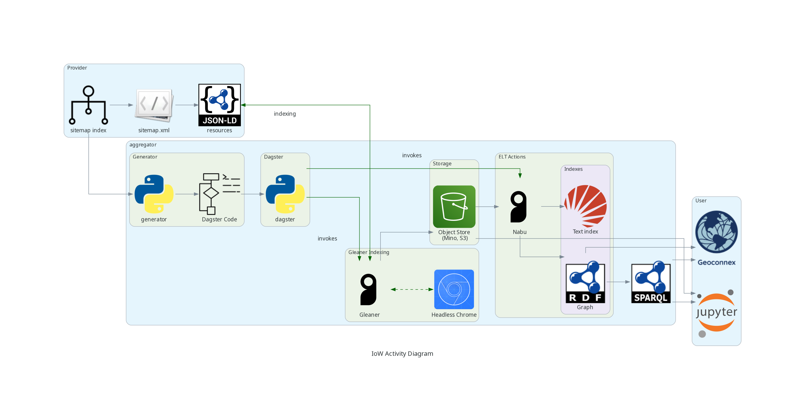
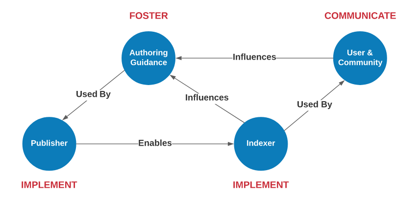

## Gleaner in the Context of FAIR Principle

### What is Gleaner

Gleaner is a tool for extracting JSON-LD from web pages. You provide Gleaner a list of sites to index and it will access and retrieve pages based on the sitemap.xml of the domain(s). Gleaner can then check for well formed and valid structure in documents. The product of Gleaner runs can then be used to form Knowledge Graphs, Full-Text Indexes, Semantic Indexes Spatial Indexes or other products to drive discovery and use.

### Principles over Project

The approach to using structured data on the web can be guided by the philosophy of _Principles over Project_.  The that import
aspects are the basic principles and not the implementation or code used to address the goal.  Nothing in Gleaner or in an activity 
implementation using Gleaner is critical.   All the components of the approach can be replaced with other approaches, including Gleaner
itself which can be replaced with many other solid software packages.  

| Principles                 | Project                                              |
| -------------------------- | ---------------------------------------------------- |
| Structured data on the web | Gleaner harvested data graphs                        |
| Web architecture           | https                                                |
| Semantics / Context        | schema.org (Science on Schema) DCAT, GepSPARQL, PROV |
| Open formats               | JSON-LD                                              |

## Example activity diagram for one user (Internet of Water)

## Personnas 

## About 

During the deisgn process of the Ocean InfoHub (OIH), many of the design approached leverage three
personas that help define the various archetypes of people who engage with OIH.  It should not be assumed
these scope all the potential persona or that a person or organization scope only one.  It is quite possible
to many.   These are simply design approaches representing potential models or characters.   They 
are tools used in the design process of OIH.

## Persona: Publisher

In OIH the Publisher is engaged authoring the JSON-LD documents and publishing them 
to the web.  This persona is focused on describing and presenting structured data on the web
to aid in the discovery and use the resources they manage. 
 Details on this persona can be found in the [Publisher](../publishing/publishing.md) section.  
Additionally, this persona would be leveraging this encoding described in the [JSON-LD Foundation](../foundation/foundation.md) section and the 
profiles described in the [Thematic Patterns](../thematics/README.md). 

## Persona: Indexer  

In OIH the Aggregator is a person or organization who is indexing resources on the 
web using the structured data on the web patterns described in this documentation.  
Their goal is to efficiently and efficiently index the resources exposed by the Publisher 
persona and generate usable indexes.  Further, they would work to exposed these indexes in 
a manner that is usable by the User persona.
Details on the approach used by OIH and potential alternatives can be found in the 
[Aggregator](../indexing/index.md) section.

## Persona: User

The user is the individual or community who wished to leverage the indexes generated
as a result of the publishing and aggregation activities. The user may be using the 
developed knowledge graph or some web interface built on top of the knowledge graph or 
other index.  They may also use query languages like SPARQL or other APIs or even 
directly work with the underlying data warehouse of collected data graphs.  

User tools may be web sites or scientific notebooks.  Some examples of these 
user experiences are described in the [User](../users/referenceclient.md) section.

## FAIR Implementation Network

We can think of the above personnas and how they might be represented in a FAIR 
implementation network.  The diagram that follow represents some of these relations.

## FAIR Principles

Recall the FAIR principles which are noted at many locations.  For reference you can visit
the Go-FAIR [FAIR Principles](https://www.go-fair.org/fair-principles/) page. 

### Findable

| Principles                                       | Project                                                                                                       |
| ------------------------------------------------ | ------------------------------------------------------------------------------------------------------------- |
| Resolvable URIs that resolve to metadata records | Web architecture based indexing  Proper @id use in JSON-LD                                                    |
| Use PIDs and Controlled Vocabularies             | Harvested data graphs (JSON-LD) to form a KG.  Keywords and other elements leverage PIDs and resolvable terms |
| Validation here though indexing and inspection   | Data graphs can be framed and used for spatial, text or semantic indexes                                      |

### Accessible  

| Principles             | Project                                                                                                                               |
| ---------------------- | ------------------------------------------------------------------------------------------------------------------------------------- |
| Distribution URLs      | Implemented with schema:distribution                                                                                                  |
| Access control details | Implemednted with schema:conditionOfAccess                                                                                            |
| Validation             | We can implement validation of these elements with SHACL  This allows us to build reports and continuous integration style approaches |

### Interoperable

| Principles                    | Project                                                                                 |
| ----------------------------- | --------------------------------------------------------------------------------------- |
| Open formats                  | JSON-LD                                                                                 |
| Open vocabularies             | schema.org, DCAT, GeoSPARQL, PROV                                                       |
| Define associated data models | Connect established data models and or associated tooling (GeoCODES resources registry) |

### Reusbale

| Principles          | Project                                                   |
| ------------------- | --------------------------------------------------------- |
| License             | shcema:license (SHACL validation)                         |
| Community standards | Ocean InfoHub, POLDER, CCADI, GeoCODEs, Internet of Water |

## Users 

The users of Gleaner are in many ways, implementation networks.  

# Users of Gleaner

The following are some communities using or exploring the use of Gleaner.

## 

[https://geocodes.earthcube.org/](https://geocodes.earthcube.org/)

GeoCODES is an NSF Earthcube program effort to better enable cross-domain discovery of and access to geoscience data and research tools. GeoCODES is made up of three components respectively.

##  Ocean InfoHub 

[https://oceaninfohub.org/](https://oceaninfohub.org/)

The Ocean InfoHub (OIH) Project aims to improve access to global oceans information, data and knowledge products for management and sustainable development.The OIH will link and anchor a network of regional and thematic nodes that will improve online access to and synthesis of existing global, regional and national data, information and knowledge resources, including existing clearinghouse mechanisms. The project will not be establishing a new database, but will be supporting discovery and interoperability of existing information systems.The OIH Project is a three-year project funded by the Government of Flanders, Kingdom of Belgium, and implemented by the IODE Project Office of the IOC/UNESCO.

## Polder: Polar Data Discovery Enhancement Research

[https://polder.info/](https://polder.info/)

Federated metadata search for the polar regions will dramatically simplify data discovery for polar scientists. Instead of searching dozens of metadata catalogues separately, a user can come to a single search page.

This is a rapidly moving field and POLDER is working to find the best path forward for our community. POLDER is a collaboration between the Southern Ocean Observing System, Arctic Data Committee, and Standing Committee on Antarctic Data Management.
 
##   Canadian Consortium for Arctic Data Interoperability

[https://ccadi.ca/](https://ccadi.ca/)

The Canadian Consortium for Arctic Data Interoperability (CCADI) is an initiative to develop an integrated Canadian arctic data management system that will facilitate information discovery, establish sharing standards, enable interoperability among existing data infrastructures, and that will be co-designed with, and accessible to, a broad user base. Key to the CCADI vision are: standards and mechanisms for metadata, data and semantic interoperability; a distributed data exchange platform; streamlined data services with common entry, access, search, match, analysis, visualization and output tools; an intellectual property and sensitive data service; and data stewardship capacity.
 

##  Internet of Water

[Geoconnex](https://internetofwater.org/geoconnex/)

Geoconnex rests on widespread adoption of metadata best practices, automatically harvesting metadata and indexing data to real-world hydrologic features (e.g. lakes, reservoirs, wells, streams, water distribution systems, monitoring locations). The resulting water-specific search index will be browsable from a common water metadata catalog for the IoW network in both a human and machine-readable format.
 

